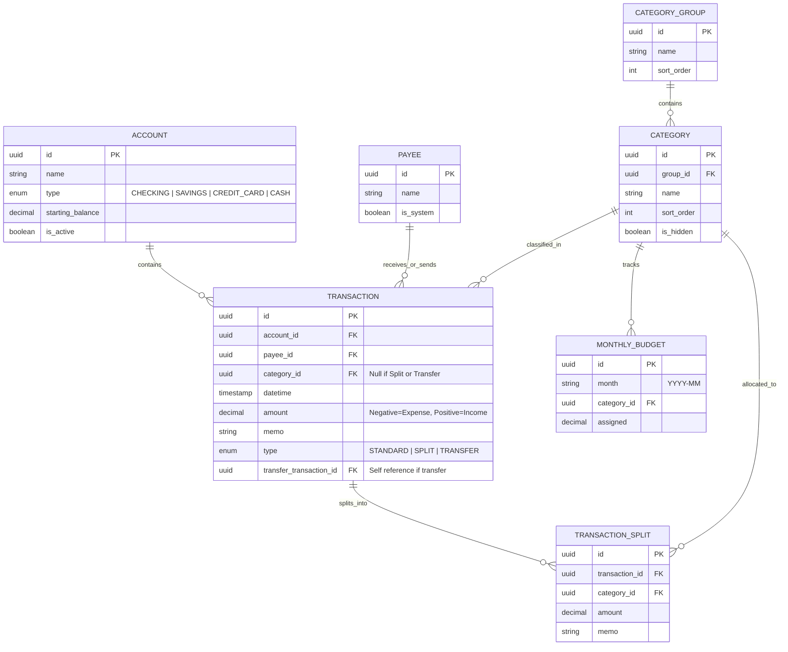
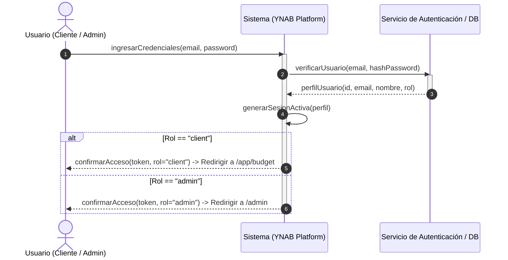
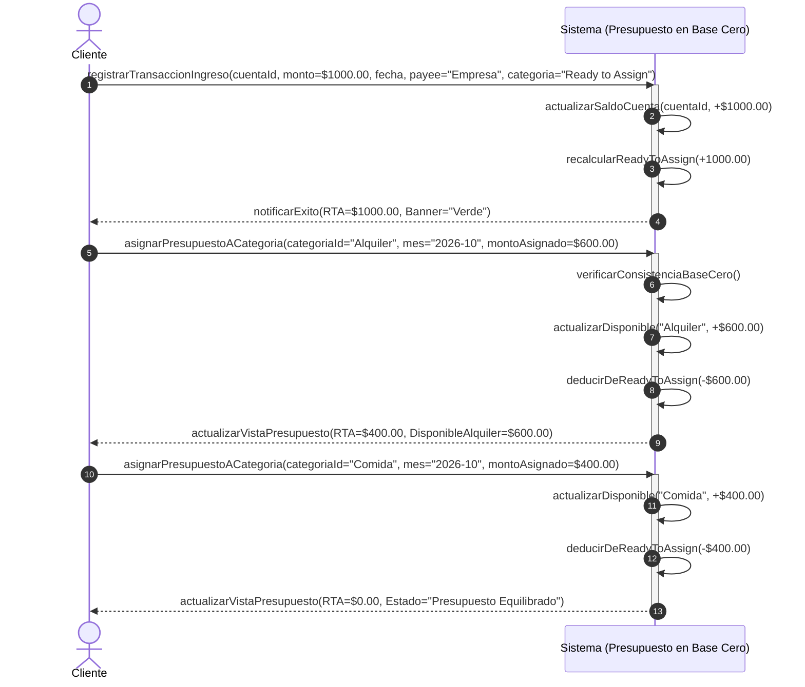
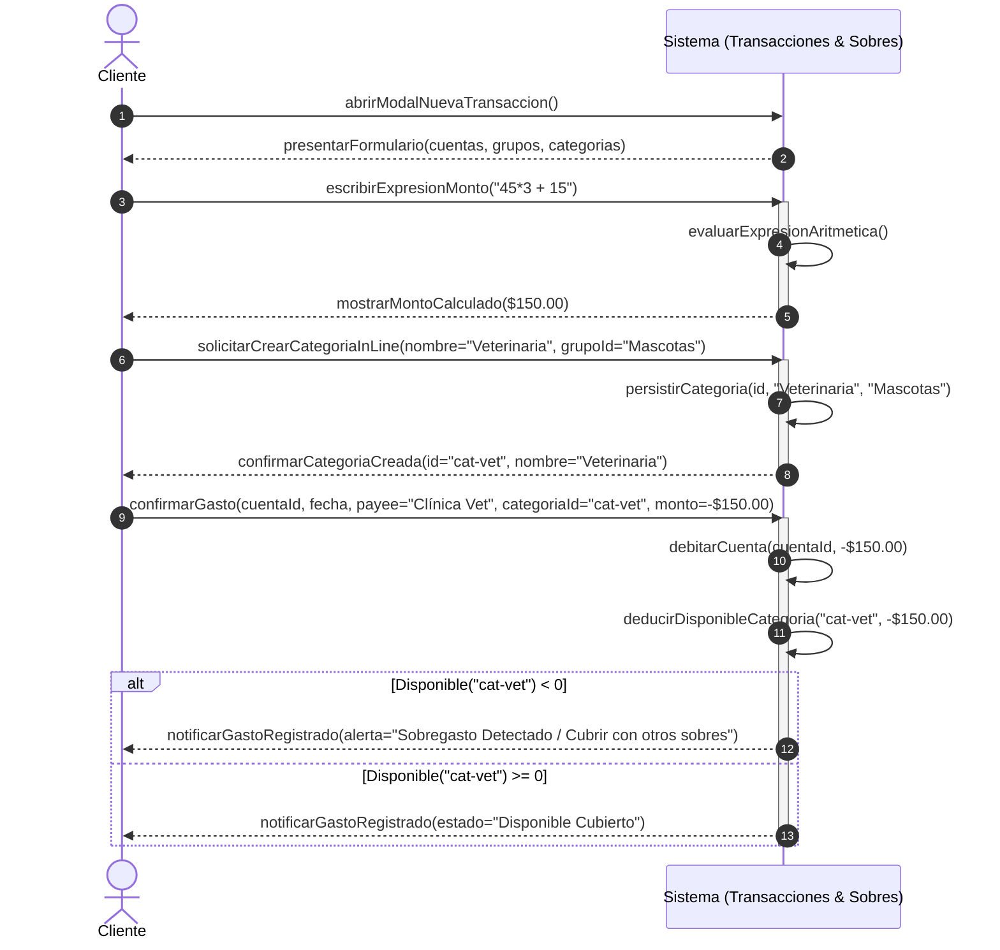
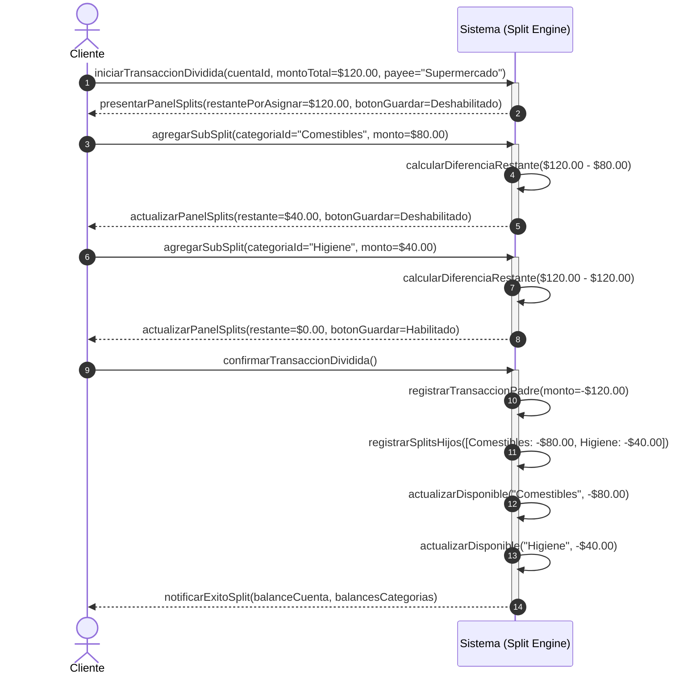
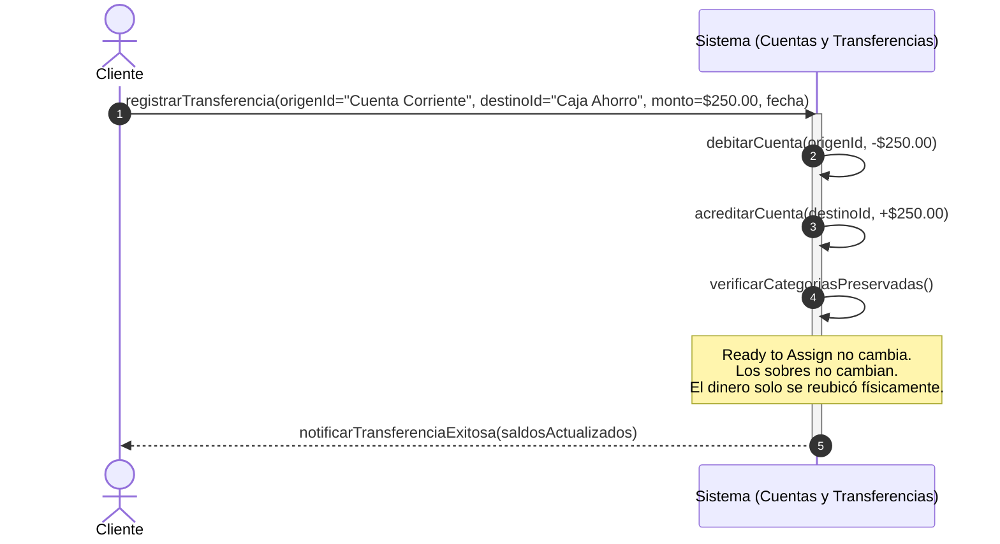
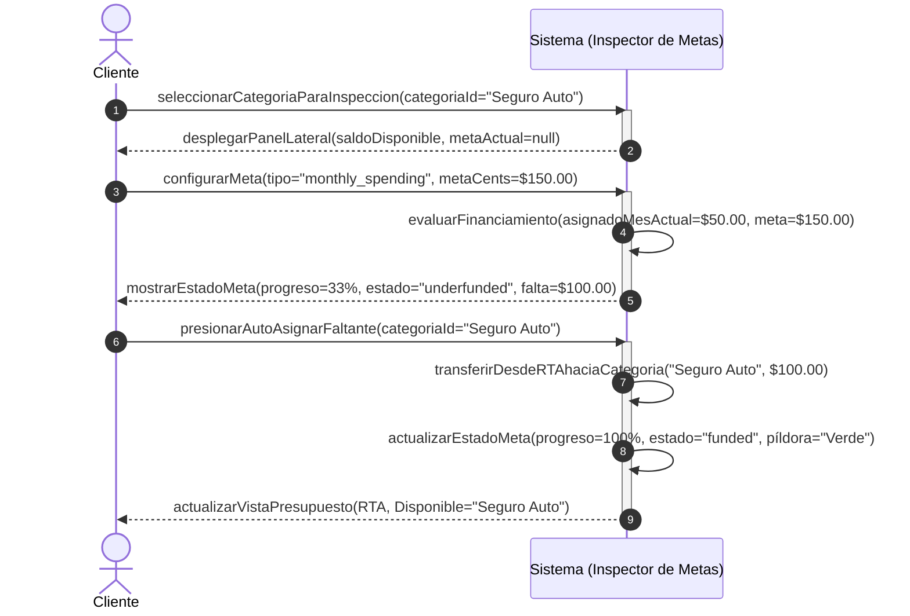
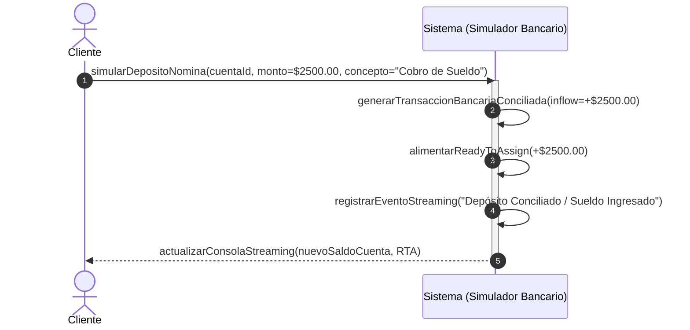
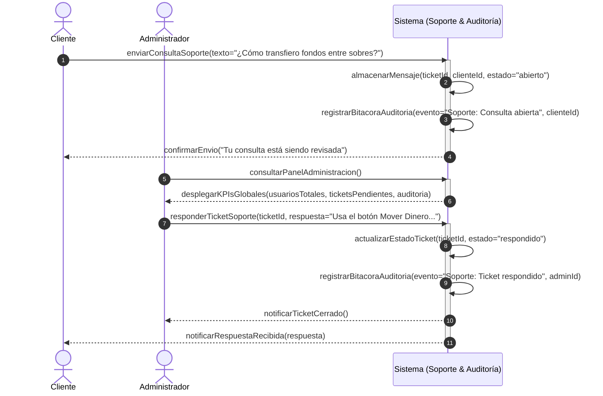

# ESPECIFICACIÓN TÉCNICA Y DE NEGOCIO (SDD - SPEC-DRIVEN DEVELOPMENT)
## PROYECTO: CLON DE YNAB (YOU NEED A BUDGET)
### Cátedra: Tópicos Proyecto 2

---

## 1. Visión y Filosofía del Sistema

El sistema implementa el método de **Presupuesto en Base Cero (*Zero-Based Budgeting*)** y el **sistema de sobres virtuales**:
1. **No se presupuesta dinero que no se tiene:** Solo se distribuyen los fondos reales existentes en las cuentas.
2. **Ecuación Fundamental de Conservación:**
   $$\text{Total en Cuentas (Efectivo/Líquido)} = \text{Listo para Asignar (Ready to Assign)} + \sum \text{Disponible en Categorías}$$
3. **Todo dinero tiene un destino:** Cada ingreso no asignado directamente a una categoría entra a un fondo central (*Ready to Assign*) para ser distribuido intencionalmente entre las categorías (sobres).

---

## 2. Modelo de Dominio y Entidades

---

## 3. Lógica de Negocio y Reglas de Transacciones

### 3.1. Tipos de Transacción

#### A. Gasto Estándar (*Expense*)
* **Monto:** Negativo (se deduce de la cuenta).
* **Beneficiario (*Payee*):** Entidad o comercio receptor (ej. "PedidosYa"). Si no existe, se crea dinámicamente al escribirlo.
* **Categoría:** Obligatoria. Se deduce del saldo `Disponible` de esa categoría.

#### B. Ingreso (*Income*) - Dos Vías
1. **Vía Estándar -> "Listo para Asignar" (*Ready to Assign - RTA*):**
   * El dinero ingresa a la cuenta y alimenta el pool global del presupuesto.
   * `RTA = RTA + Monto`.
   * El usuario luego asigna manualmente este dinero a los sobres en la vista de presupuesto.
2. **Vía Directa -> Categoría Específica:**
   * Utilizado para reembolsos, devoluciones o reposición directa de un gasto previo.
   * El dinero entra a la cuenta y se suma directamente al `Disponible` de la categoría seleccionada sin pasar por *Ready to Assign*.

#### C. Transferencias entre Cuentas (*Account Transfers*)
* **Comportamiento:**
  * Crea dos transacciones vinculadas (o una transacción con cuenta origen y cuenta destino).
  * Cuenta Origen: Débito ($-Monto$).
  * Cuenta Destino: Crédito ($+Monto$).
* **Regla de Oro de YNAB:** Si ambas cuentas son cuentas de presupuesto (*On-Budget*), **la transferencia NO requiere categoría ni afecta a "Ready to Assign" ni a los sobres**. El dinero solo cambió de lugar físico, pero sigue teniendo el mismo trabajo asignado en los sobres.
* **Beneficiario Especial:** Se autogenera como `Transfer : [Nombre de Cuenta Destino/Origen]`.

#### D. Transacción Dividida (*Split Transaction*)
* Permite dividir un único ticket/movimiento de cuenta entre 2 o más categorías distintas.
* **Invariante Matemática Estricta:**
  $$\text{Monto Total Transacción} = \sum_{i=1}^{n} \text{Split Amount}_i$$
* La UI debe mostrar en tiempo real:
  * Monto Total.
  * Monto Asignado en Splits.
  * **Monto Restante por Asignar (*Remaining/Unassigned*)**: El botón "Guardar" debe estar bloqueado hasta que el restante sea exactamente `0.00`.

---

## 4. Usabilidad e Interacciones Complejas (Criterios Clave de Evaluación)

### 4.1. Input Numérico con Calculadora Integrada
* **Requisito:** Cualquier campo numérico (monto de transacción, monto asignado a presupuesto, sub-splits) debe aceptar expresiones aritméticas.
* **Operaciones soportadas:** Suma (`+`), Resta (`-`), Multiplicación (`*`), División (`/`), Paréntesis `()`, y Decimales (`.` o `,`).
* **Comportamiento UX:**
  1. El usuario escribe: `90*6` o `150 + 25.50 - 10`.
  2. Al pulsar `Enter`, `=`, `Tab` o perder el foco (*blur*), la expresión se evalúa de manera segura y el campo se actualiza al valor calculado con formato de moneda: `$540.00`.
  3. Si la expresión tiene un error sintáctico (ej. `90*` o división por cero `100/0`), se muestra un estado de advertencia sutil sin romper la aplicación y se evita el guardado con valor NaN.
* **Seguridad:** No usar `eval()` plano de JavaScript. Usar un parser de expresiones matemáticas seguro basado en tokens o AST (o biblioteca matemática segura).

### 4.2. Creación *In-line* (al vuelo) de Categorías y Grupos
* Desde el formulario modal de registro de transacción:
  * El usuario abre el selector de categorías.
  * Si escribe una categoría que no existe (ej. "Veterinaria"), el selector ofrece la opción:
    * `+ Crear categoría "Veterinaria"`.
  * Al hacer clic, se abre un sub-menú desplegable que permite:
    * Asignarla a un Grupo de Categorías existente (ej. "Mascotas").
    * O crear un **Nuevo Grupo de Categorías** en el mismo instante.
  * Al confirmarse, la categoría se crea en el sistema y queda inmediatamente seleccionada en la transacción sin cerrar ni reiniciar el formulario.

### 4.3. Reactividad y Recálculo Dinámico en Casos de Edición y Eliminación
* Al no existir conciliación bloqueante:
  * Si el usuario edita una transacción de hace 3 semanas cambiando el monto de `$50` a `$80`:
    * El saldo de la cuenta se ajusta en `-$30`.
    * El saldo de la categoría se ajusta en `-$30`.
  * Si se elimina una transacción:
    * Se revierte completamente su impacto en la cuenta y en la categoría correspondiente.
  * Si se edita una transferencia:
    * Ambas cuentas vinculadas deben actualizarse en sincronía inmediata. Si se borra un extremo, se borra el otro.

---

## 5. Matriz de Casos Borde Críticos (Advertencia del Docente)

| ID | Escenario / Caso Borde | Comportamiento Esperado del Sistema |
| :--- | :--- | :--- |
| **CB-01** | **Sobregasto (*Overspending*):** Un gasto supera el disponible en un sobre (ej. Disponible \$20, Gasto \$50). | La categoría queda en negativo rojo (`-$30.00`). No bloquea el gasto, pero advierte visualmente al usuario que debe "cubrir el sobregasto" moviendo fondos de otra categoría. |
| **CB-02** | **Edición del Total de un Split Existente:** El usuario abre una transacción dividida de \$100 (Split: \$60 y \$40) y cambia el total a \$120. | El sistema detecta la discrepancia: "Restante por asignar: \$20.00". Deshabilita el botón Guardar hasta que el usuario ajuste los splits o añada un nuevo split. |
| **CB-03** | **Eliminación de Categoría con Historial:** El usuario intenta eliminar una categoría que tiene transacciones asociadas. | El sistema bloquea el borrado directo o solicita: "Reasignar transacciones existentes a otra categoría" o "Ocultar categoría (*Hide Category*)", protegiendo la integridad referencial. |
| **CB-04** | **Conversión de Tipo de Transacción:** Una transacción simple se edita para convertirse en Transferencia o Split. | Limpia o reestructura los campos dependientes (si pasa a transferencia, elimina la categoría asignada; si pasa a split, expande la tabla de líneas de split). |
| **CB-05** | **División por cero o expresión inválida en calculadora:** Usuario escribe `50/0` o `12++3`. | Captura el error en tiempo real, marca el borde del input en rojo con tooltip descriptivo ("Expresión matemática inválida"), y mantiene el valor previo válido al pulsar guardar. |
| **CB-06** | **Transferencia a la misma cuenta:** Usuario selecciona Cuenta Origen = Cuenta Destino. | Validación inmediata en formulario: Deshabilita la opción de seleccionar la misma cuenta o muestra error antes de permitir el envío. |
| **CB-07** | **Listo para Asignar en Negativo (*Overallocated*):** El usuario asigna más dinero a los sobres del que ingresó a RTA. | El banner superior de *Ready to Assign* se vuelve rojo con saldo negativo (ej. `-$150.00 Necesitas asignar menos`), reflejando que se presupuestó dinero inexistente. |

---

## 6. Arquitectura de UI / Wireframes Conceptuales

### Vista 1: Pantalla Principal de Presupuesto (*Budget View*)
* **Top Bar:** Banner interactivo de **"Listo para Asignar / Ready to Assign"** (Verde si es positivo o cero, Rojo si está sobreasignado).
* **Navegador de Meses:** Permite alternar entre meses anteriores, actual y siguiente.
* **Tabla de Categorías:**
  * Estructura en acordeón por Grupo (ej. `Necesidades Inmediatas`, `Calidad de Vida`, `Ahorros`).
  * Columnas: `Categoría` | `Asignado (Editable con Calculadora)` | `Actividad / Gastado` | `Disponible (Píldora Verde/Gris/Roja)`.

### Vista 2: Registro de Cuentas (*Accounts Register*)
* Barra lateral (*Sidebar*) con lista de cuentas (Efectivo, Banco, Ahorros) y sus saldos actuales.
* Tabla central con historial de transacciones: Fecha, Beneficiario, Categoría, Memo, Salida (Outflow), Entrada (Inflow), Acciones (Editar/Borrar).
* Botón destacado `+ Añadir Transacción`.

### Vista 3: Modal de Transacción Inteligente
* Tipo: Gasto / Ingreso / Transferencia / Split.
* Campo de Cuenta (Dropdown).
* Campo de Fecha y Hora.
* Campo de Payee (Autocompletado con creación rápida).
* Campo de Categoría (Dropdown jerárquico con `+ Crear`).
* Campo de Monto (Input con calculadora).
* Panel dinámico de Splits (si está activado).

---

## 7. Diagramas de Secuencia del Sistema (SSD - System Sequence Diagrams)

Los Diagramas de Secuencia del Sistema (SSD) formalizan los eventos de entrada y salida entre los Actores del dominio y la caja negra del **Sistema (YNAB Engine & Platform)** para cada caso de uso principal evaluado en la cátedra de **Tópicos Proyecto 2**.

### SSD-01: Autenticación, Verificación de Credenciales y Redirección por Rol
Permite a clientes y administradores identificarse con su correo y contraseña, recibiendo la interfaz correspondiente según su rol en base de datos.

### SSD-02: Registro de Ingreso ("Ready to Assign") y Asignación de Presupuesto en Base Cero
Representa el flujo fundamental de YNAB: entrar dinero real a la mesa y asignarlo a sobres hasta que *Listo para Asignar* sea 0.00.

### SSD-03: Registro de Gasto Estándar con Calculadora y Creación In-line de Categoría
Ilustra la creación de categorías al vuelo y la evaluación matemática de expresiones aritméticas durante el registro del gasto.

### SSD-04: Transacción Dividida (*Split Transaction*) con Invariante a Cero
Garantiza que la suma de los sub-splits equivalga con exactitud al total gastado en el ticket.

### SSD-05: Transferencia entre Cuentas Vinculadas (Regla de Oro de YNAB)
Ilustra el movimiento de fondos entre dos cuentas de presupuesto sin afectar categorías ni *Ready to Assign*.

### SSD-06: Configuración e Inspección de Metas de Ahorro (*Category Targets*)
Permite establecer objetivos mensuales con financiamiento guiado.

### SSD-07: Simulador Bancario Interactivo ("Dinero en la Mesa")
Permite inyectar depósitos de nómina y gastos automáticos simulados.

### SSD-08: Centro de Soporte al Cliente y Auditoría Administrativa
Permite la comunicación cliente-administrador y la fiscalización del sistema.

